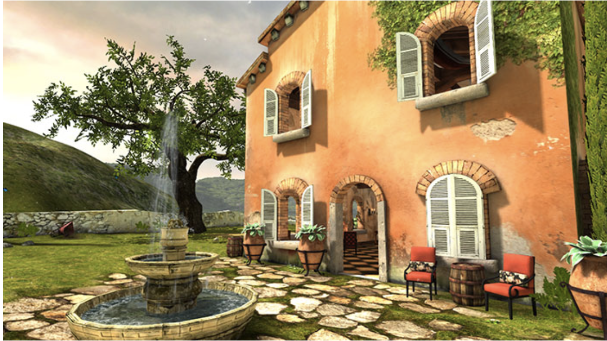
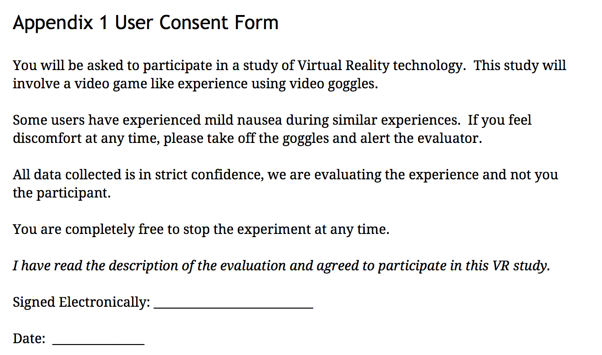
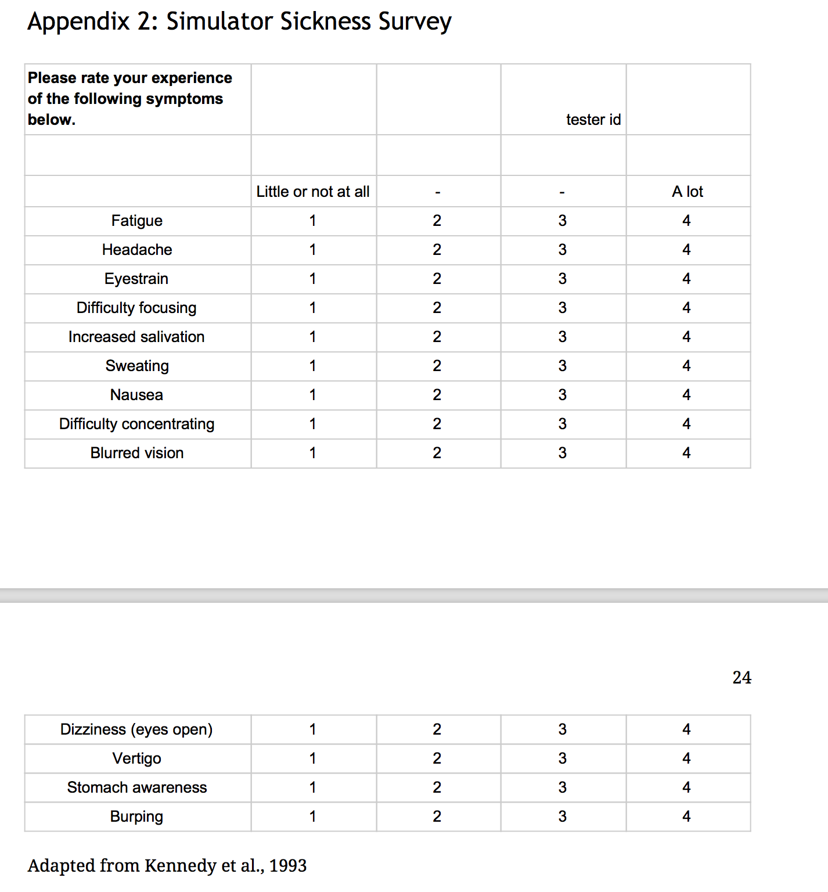
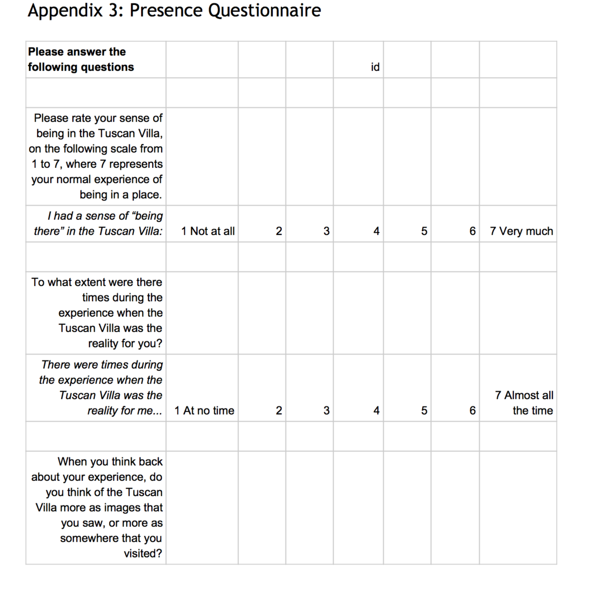
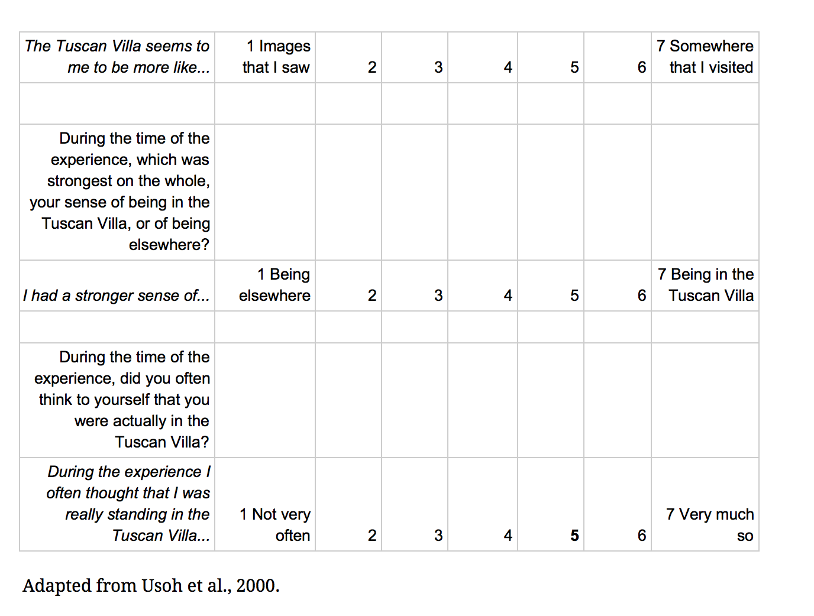

# Heuristic and Empirical Evaluation of an Oculus Rift Based Virtual Reality Experience.

## Samuel Halperin

Screenshot from application under test, the Tuscan Villa Demo by Oculus. (image courtesy of share.oculus.com)

# Contents
Introduction
1. Library Research on the Heuristic Evaluation of VR Experiences
2. Heuristic Evaluation of the Tuscany Demo
3. A Brief Look into Considerations for Empirically Testing Virtual Experiences
4. Empirical Evaluation of the Tuscany Demo
Conclusion and Future Research

# Introduction
In a speech to game developers in 2014, Palmer Luckey, the inventor of the Oculus Rift, asserted that content creation for the new devices is not merely a matter of porting existing content, but creating entirely new game elements (Luckey 2014).  Perhaps this is due to what Steptoe et. al. refer to as the defining characteristic of these devices, the psychophysical non-mediation, or the sensation that the participant is experiencing a reality unmediated by the technology (Steptoe, Julier & Steed, 2014).  This is historically referred to as presence.  Perhaps because these devices uniquely create a sense of presence, experiences must be designed specifically for them.

Luckey also noted limitations with the device manufactured by his company, centering on what is alternatively referred to in the literature as cybersickness (CS) (Davis, Nesbitt & Nalivaiko, 2014) and historically simulator sickness (SS) (Kennedy, Lane, Berbaum & Lillenthal, 1993).  Luckey specifically promised an accommodation to these side effects noting that a user with many hours of VR time would respond differently to VR than a novice user.    This might however reflect a survivor bias among those users, with the role of a selection bias affecting the composition of a resulting group when picking participants from among groups of people that aren’t naturally susceptible to motion sickness (Davis et al.,  2014).

 VR naivete has been a focus of research going back as far as work done for Disney by Randy Pausch in 1996 and experienced by 45,000 novice theme park visitors (Pausch, Snoddy, Taylor, Watson & Haseltine, 1996).  The technology used in that experiment, while heavier, more expensive, and more cumbersome, is similar to the Oculus Rift in that it used a fully occlusive, orientation tracked (i.e. look left, see left), head mounted display.  Pausch’s result was that participants at Disney experience VR much in the same way they experience other “thrill” rides.  Pausch concluded that virtual experiences (VE) must be conducted within constraints around experience length and intensity, governed by nausea.

VR studies have typically been done in VR naive populations (i.e. in people who have never experienced immersive virtual reality) but this focus may not be an effective way to create compelling experiences for non-naive users.    Whether the mechanism in producing veteran VR users is selection or accommodation, or some combination of both, experiences still need to be designed specifically for them.  First VR experiences, like the one studied in this paper produce interest in the device, but as Luckey points out above, there is a real need to produce content for people who own, and continuously use the devices.

The need to test in VR-experienced populations presents a problem for experimenters because the technology has not pervaded the general population in the way that smartphones or desktop computers have.  Heuristic evaluation of VR experiences, the evaluation of content along a set of heuristic guidelines by experts (Nielsen & Molich, 1990), rather than from empirical user tests , may be one approach for creating good content for VR veterans.  

Heuristic evaluation in general and in particular the heuristic evaluation of VR experiences (Sutcliffe & Gault, 2004) is a long established technique that informs the design process of experiences, and augments user testing.  It is tempting as researchers to put aside the wealth of existing research on head mounted display based experiences, and the assertion (from Luckey, echoed by users who experience the hardware directly in our study) that we should “figure out” how to write content for these devices is prevalent.   We should focus on how to make content for these devices in a conscientious review of the existing work based on interface characteristics (head mounted display, field of view, tracking capabilities, latency), not publication date.   There is a wealth of existing publications on VR experiments to guide the creation of these heuristics, some of which is reviewed below. 

Already completed studies on head mounted displays similar to the rift can inform Oculus Rift content development, and specifically speak to the challenges of simulator sickness and the possibility of creating experiences centered around presence.  Heuristics must not be grounded in the mythology of VR experiences, but in real user-centered experimentation around developed artifacts with human participants (whether gleaned from primary sources or conducted in the lab).  The rest of this paper opens the door to that process, presenting a set of heuristic VR evaluation points gleaned from historical user studies,  juxtaposed with a limited (n=2) user test. 

The user study informed the process of extracting the heuristics from past empirical work as well as provided a good learning practicum for structuring future empirical studies of VR.   User feedback, both from the limited study performed here and from historical experiments,  center around both well known issues like hygiene, experimenter-participant interaction, simulator sickness, and presence;  and hard to predict ones like the importance of resetting controls sensitivity (e.g. of the mouse) before running an immersive VR experience on a workstation that is also used as a word processor/web browser..etc.   The latter category, represents meaningful experience in studying how users interact with real artifacts, and is the source of the most valuable insight in this work. Insights documented by primary-sourced materials  on some level also  obviated the need to repeat mistakes that have already been documented.

A potential criticism of this work is that it overly relies on non-current research on virtual reality and virtual environments.  In its defense, this is due to the reemergence of VR into the mainstream.  Much of the laboratory-based research,  is newly relevant to the software engineering of these new consumer experiences.   Work done in labs and in theme parks on expensive, custom, cumbersome hardware can be continued on these new, cheaper, lighter, more powerful and more widely available devices.

# 1 Library Research on the Heuristic Evaluation of VR Experiences
## Heuristics Centering on Simulator Sickness

Considerations around users becoming nauseous from exposure to VR permeates the VR literature and has been covered in systematic reviews as recent as 2014 (Davis et al., 2014).  Davis cites three theories for why many users, including a user in our study, feel queasy during or after a VR experience.  These are:  A sensory conflict theory where nausea arises out of the mismatch between what the inner ear senses and what the eye sees.   Postural stability, the way that vection, or self movement, unconstrained by human limitations or physics in a virtual environment triggers our systems for maintaining the integrity of our upright poses. Finally, the poison theory, or the idea of an evolutionary mechanism for creating nausea in order to purge toxins when the human brain perceives the organism to be hallucinating.

Heuristics in this class of phenomenon are:

1. The participant should have autonomy over movement in the virtual environment.  Camera movements should be initiated by the user. (Luckey 2014)

2. While head tracking is a significant distinguishing feature of head mounted display based experiences, overly relying on grosse head movements in a VE is undesirable. (Luckey 2014)

3. The length of the VE should be limited, particularly in novice users, as one would limit the length of a theme park ride. (Pausch et al., 1996 )

*Pausch’s study, which was seen by a claimed 45,000 users at Disney, intentionally focused on non-technically-interested users, the desire to evaluate for novice theme park users.    Owning a computer powerful enough to render something like Pausch’s Aladdin Experience, not to mention a personal head mounted display, would have been unheard of in 1996, and necessarily imposes a different design constraint (designing for novices) than keeping an Oculus Rift owner interested (designing for VR veterans.)

4. The presence of lag between the vestibular and proprioceptive perception of movement, and its visual perception makes people sick. (Davis et al., 2014)   I.e. as created by improper reliance on computation in a real time rendering, 

5. VEs should not overly rely on the navigation techniques of the First Person Shooter genre of video games, or should do so only in experienced users  (Luckey 2014).  Vection in VEs is a source of SS (Davis et al., 2014).

## Heuristics Centering on the Cognitive Demands of VR
	
The 1996 study of a Disney Theme Park rendering of Aladdin's Magic Carpet Ride reimagined as a VR experience is still relevant because it is one of the few examples of a VR experiment done at a large scale of 45,000 people (Pausch et al., 1996).  In that study, Pausch noted that VR imposed an increased cognitive burden on participants over video displays, with some users unable to speak during and shortly after the experience .

A later study of text legibility using immersive displays, while not experienced at the same scale, and not explicitly referring to cognitive burden  (over say visual strain), nevertheless specifically programmed in rest breaks for experimental participants. (Gabbard, Swan, Hix, Kim & Fitch, 2007).  This study, also explicitly left out of their experimental methodology, any evaluation of the participants semantic understanding of the text that they read, focusing only on letter form recognition.  Here the experimental design seemed to factor out the effect of cognitive load, focusing instead only on identifying letter forms.

Mine (2003) also writing about Disney experiences, also speaks to the cognitive demands of VR, discussing how VE’s should utilize participants native skills, and not overtax them with new navigational or visual paradigms to learn.  Mine reflected that these consumer VR experiences were thus constrained to navigation and targeting/shooting.  This conclusion again reflects his target audience (VR naive Disney visitors), and is relevant to VR trade shows and first Oculus Rift experiences. It represents a theory of usability in VR experiences centered on cognitive load, but should be evaluated carefully in the context of users with personal VR displays and hundreds of hours of goggle time.

Heuristics gleaned, from this work on cognition and VR include:

6. Program in breaks for users. (Gabbard et al., 2007)
7. Recognize where users will be deficient in their abilities to learn new paradigms due to cognitive load and design experiences accordingly.
8. Periodize the use of native skills versus the learning of new interactions where the desire is to teach a new interaction paradigm.
9. Use iconography in a way that is conscious of the cognitive load on the user at the time they are to be understood, and the cognitive demand of parsing their semantics.

### Heuristics Centering on the Uninterrupted Perception of Non-Mediation (Presence)

Pausch et al., note that in order to tell a story with a VR experience, presence must be actively maintained, with elements of the experience that break presence conscientiously managed.   While Pausch was referring to common rendering glitches, new research takes up this mantle, comparing the apprehension or misapprehension of an object as physically real when various rendering techniques are used (Steptoe et al, 2014).

Heuristics gleaned from this work are:		

10. Objects in the scene interpenetrating in non-realistic ways break presence. (Pausch et al., 1996)
11. Characters in a VR experience should turn to face the user when in proximity. (Pausch et al., 1996)
12. All objects in the scene should be rendered at a consistent level of detail and texture (Steptoe et al., 2014)

## Heuristics Centering on Text Legibility

If text is to be a key component of applications developed for the Rift, then considerations for text legibility have to be taken into account.   Text legibility depends primarily on visual contrast between the figure and ground in terms of value, and also color and pattern.  (Gabbard et al., 2007)  
The Oculus Rift has a limited resolution of 640x480 pixels per eye, and displays a visible screen-door pattern with distinct pixel boundaries.  Both users in the study below commented about what they perceived as “low resolution”.  For this reason, text rendering on a Rift is a challenge.  An experiment into the minimum legible type size might be conducted, but a good estimate might be that the Rift can display something on the order of 20-30 columns legibly (without panning the display using head tracking.)

Heuristics for text readability are:

11. Text should be presented with a good visual contrast between figure and ground (Gabbard et al., 2007, writing specifically about Augmented Reality)

# Part 2: Heuristic Evaluation of the Tuscany Demo
Although heuristic evaluation with only one expert is not very effective (Nielsen & Molich, 1990), that is what is presented below as an exercise.  This information is presented in table form, with the evaluation of the Tuscany Demo (TD) referencing the numbered heuristics discussed above.    

|Criteria|Evaluation|
|----|-----|
| 1)   Autonomy   over   camera   movements | TD   does   not   animate   the   camera   except   in specific   response   to   either   mouse, keyboard   or   head   movements.         Better in-app   rate   control   could   be   added   as mouse   sensitivity   for   brower   tasks   may impose   different   demands   than   VE   tasks. (4   out   of   5) |
| 2)   Limited   use   of   head   tracking | TD   relies   on   head   tracking   for   exploring the   environment,   but   does   not   ever demand   large   rotations   for   operating   the interface.   (5   out   of   5) |
| 3)   Limited   length   of   VE | TD   imposes   a   geographical   constraint   on the   experience.      The   environment   is bounded   by   a   virtual   brick   wall   and therefore   imposes   a   built   in   constraint   on the   length   of   the   experience.   (5   out   of   5) |
| 4)   Avoid   lag | TD   includes   a   high   degree   of   realism,   but performs   well.   (5   out   of   5) |
|5)   Avoid   vection   based   navigation|TD   exclusively   involves   “walking”   around a   VE,   although   it   does   this   in   a   way proportional   to   inputs   (see   1)   above.      (3 out   of   5)|
|6)   Program   in   breaks   for   users|TD   includes   no   guidance   on   how   long   to use   this   first   VR   experience.      It   is   surmised (based   on   the   user   study   below)   that   many users   operate   TD   up   until   the   point   that they   feel   nauseous.   (2   out   of   5)|
|7)   Rely   on   native   skills|TD   is   conservative   in   the   sense   that   it   uses a   very   common   keyboard   and   mouse paradigm   for   navigation,   adding   only head   tracking   based   perspective   changes. (5   out   of   5)|
|8)   Periodize   the   introduction   of   non-native interaction   paradigms.|N/A      TD   does   not   introduce   any avant-garde   interaction   paradigms.|
|9)   Conscious   use   of   iconography|N/A   TD   does   not   have   any   interfaces   that rely   on   icons.|
|10)   Avoid   interpenetrating   objects|TD   uses   well   designed   graphics.      There   are no   obvious   signs   of   interpenetration.   (5 out   of   5)|
|11)   Characters   should   respond   to   the viewer.|N/A   there   are   no   characters   in   TD.|
|12)   Consistent   level   of   detail   and   texture.|TD   consistently   renders   the   environment with   a   high   level   of   realism.   (5   out   of   5)|

Table 2.1: Summary Heuristic Evaluation of the Tuscany Demo 

# Part 3: A Brief Look into Considerations for Empirically Testing Virtual Experiences

Sequential versus Testbed Testing

Bowman et. al., suggest a conceptual division in VR usability testing:  They categorize tests into a “testbed” approach, whereby the components of a VR application are studied absent the context of the larger application.  Modular units such as interaction dynamics and user interface widgets are tested on their own for efficiency and ease of use.   The companion to testbed testing in the Bowman et al. taxonomy is sequential testing.  Here, the entire application is tested, with interface and dynamics evaluated in the context of how they inform the solution in the particular domain of the application under test.

The Tuscany Demo evaluated below is at once an example of a sequential test of an entire application, but at the same time it narrowly presents a testbed for evaluating the navigation paradigm and rendering style used in the app.  (In some sense the Tuscan Villa experience is a ‘tech demo’ that doesn’t really address a particular problem domain, or propose any particularly new interaction paradigms.) 

Maintaining Presence during Evaluator / Participant Interaction

The point of both styles of testing is to evaluate some phenomenon of the experience, i.e., presence, simulator sickness, UI usability...etc  In VR much attention has been put on one phenomenon in particular, alternatively called psychophysical non-mediation and presence. (Steptoe et al., 2014; Usoh et al., 2000, Bowman, Gabbard & Hix, 2002)   Both Steptoe and Bowman point to usability test practices specifically created to minimise the interaction between evaluator and subject in terms of interrupting presence.  Steptoe, in an experiment that compared users perception of simultaneously viewed real and virtual objects in an attempt to understand how users discern the real and virtual, used sound muting headphones to block out sound generated by setting up the experimental environment. Bowman in his theory paper on UE in VR discussed how even spoken instructions from the evaluator can interrupt presence.

Measuring Presence

The experience of presence is commonly measured with a post-hoc survey (Usoh et al., 2000).  In the study below, the experience of presence was not a subtle phenomenon.   User interviews produce comments that the environment feels real, that they are experiencing something more akin to being in a place rather than viewing a photo or video of it, long before the questionnaire is administered.  These comments are coded in the study below to reflect this. 

Handling and Measuring Simulator Sickness
A phenomenon as widely studied as presence is simulator sickness.  Here, we can glean some experimental guidelines from the research.  VR experiences should initially be of limited length (Pausch et al., 1996).  They should also be performed ethically with consent that goes beyond legalistic consent forms to include spoken, comprehended, instructions about ceasing the experiment on any discomfort.  Simulator sickness has been widely studied, with many experiments using instruments that measure sickness in their post-hoc evaluation of the users experience.  (For instance the instrument used in this paper is the one developed by Kennedy et. al. 1993)

Novelty

In the evaluation presented below, task efficiency of navigation in VR was one of the phenomenon studied.  Ie how does being in goggles, having a head tracker, and highly realistic graphics, being present, and potentially being somewhat nauseous due to SS, effect the task efficiency of something that could be done on a desktop (ie in a video game) without these additions?   From the limited trial below, here again the fact that most users are VR novices comes into play, with one user literally asking if he could “take the long way” in a navigation task in order to experience more of the scenery, thus rendering the task efficiency timing results fairly useless.

# Part 4: Empirical Evaluation of the Tuscany Demo

Methodology

Two subjects were selected from colleagues at the authors coworking space.  One participant had experience with approximately 2-3 minutes of VR time at trade shows, while another had no exposure to a head mounted display.

The participants were put through a three minute VR experience using the ‘Tuscany Demo’ (TD) distributed with the Oculus Rift.  TD is a highly realistic audio/visual simulation of a rustic, hilltop villa by the seashore.  It features elements such as flying butterflies, a spewing fountain that makes water noise, and sailboats tacking back and forth in a bay.

|Task|Time To Complete Task|
|---|---|
|Relax   until   you   are   comfortable   and   then look   to   your   right   and   find   the   fountain.|0:15   -   0:30|
|Navigate   inside   the   building   and   find   the fireplace.|0:08   -   0:15|
|Exit   the   building   and   find   the   sailboats.|0:30   -   0:32|
|Re-enter   the   building   and   find   the balcony.|0:43   -   1:50|

Table 4.1: VR navigation tasks.

The participants were guided through the tasks in the table 4.1.  Originally more tasks where planned, but after the completion of the third task, at approximately 3 minutes into the demo, one participant complained of “feeling funny” so the experiment was stopped.  This breakpoint was used as the stopping point for the second user evaluation, with the second user reporting markedly less simulator sickness.  After a few minutes of break, the participant completed a simulator sickness questionnaire (Kennedy et al., 1993) and a presence questionnaire (Usoh et al., 2000).

# Results and Discussion
The tasks in this UE were navigational, and the participants were able to find each waypoint successfully.  The subject reported a moderate sense of presence, with comments about the reality of the experience, and feelings that they were in a foreign place.  However, they also experienced a significant degree of ‘stomach awareness’ and ‘dizziness’ as noted in the results of the SS questionnaire, see table 4.4 below.

A question to ask in consideration of both the mean and the max values in the simulator sickness survey results is as follows:  Does the presence of a mean value towards the low end of the SS scale reflect a general system usability, or does the presence of a single high SS rating for “eye strain” or “dizziness” reflect a significant, potentially insurmountable problem?  I.e., from where do we draw a qualitative conclusion about whether the Oculus Rift and Tuscany Demo makes users sick, their general feeling that the symptoms are mild -- this was a common comment from both users, or their selection of near maximal ratings for individual symptoms? 
 Does it matter that the experience was generally tolerable if, for instance, eye strain becomes extremely intolerable over a short period of time?

|Question|Summary Insights|
|---|---|
|Do   novice   VR   participants   experience simulator   sickness   on   initial   use   of   the Oculus   Rift?|The   participants   experienced   mild   to moderate      SS.|
|Do   participants   experience   ‘presence’   or the   sensation   of   inhabiting   a   virtual space?|Yes,   the   participant   experienced   a sensation   of   presence.|
|Can   participants   find   waypoints   by navigating   using   the   immersive   interface?|The   participant   efficiently   found waypoints.|
|Do   participants   feel   that   VR   represents   a compelling   experience?|The   participants   expressed   curiosity   about VR,   particularly   with   respect   to   touring remote   locations.|
|Are   there   other   applications   of   VR   outside of   the   ones   represented   by   the applications   under   test?|The   participant   was   most   curious   about the   application   under   test   and applications   in   a   similar   domain.|

Table 4.2  Summary Insights. The usability evaluation of the virtual reality applications was conducted to answer the questions below.

The biggest usability issue with the experience, as reflected in user comments (see Table 4.3 below) was the issue with simulator sickness.  While the mean score was towards the low end of the scale, one user reported scores of 3 out of 4 for “awareness of stomach” and for “dizziness.”

|Statement|Coding|
|---|---|
|“The   goggles   seem   a   little   grungy”|Physical   interface|
|“I   feel   funny.”|Simulator   Sickness|
|“The   biggest   issue   was   the   nausea.”|Simulator   Sickness|
|“It   was   cool   to   experience   a   new place”|Presence|
|“Nausea   is   a   deal   breaker”|Simulator   Sickness|
|“I   feel   disembodied”|Embodiment|
|“I   feel   like   a   floating   head   in   space”|Embodiment|
|“I   would   like   to   be   able   to   get   up and   walk   around.”|Physical   Interface|
|“Reminds   me   of   the   first   time   I experienced   a   touch   interface.”|Physical   Interface|

Table 4.3  Representative statements and coding for participant feedback.

User feedback was coded into four categories, comments about: the physical interface, simulator sickness, presence, and embodiment. 

In terms of the physical interface, the most prevalent comments seemed to center around the perception of VR goggles as a personal article of clothing. In the Disney study, Pausch et al., allowed for this by having the headset use a removable personal liner (1996).

User comments about what can be referred to as “embodyment” were  comments like “I feel like a floating head”, and “I wish I could interact with the environment by walking” or “so I can’t see my body”, “where are my hands”, imply a desire for a human machine interaction that goes beyond viewing.  Interestingly the head tracking afforded by VR, while entirely new and non-trivial from an engineering standpoint is perceived as transparent.  Head tracking is a natural interaction, like gesture on a smartphone.  This is a credit to its implementation, but it also flies in the face of the notion that simply being able to physically look around a ‘real’ environment is enough interaction design to make VR compelling.

||Presence, User 1 (1-5)|Presence, User2 (1-5)|Simulator Sickness User 1 (1-6)| Simulator Sickness User 2 (1-6)|
|--|---|---|---|---|
|mean|3.4|2.33|1.54|1.21|
|stdev|1.34|2.16|0.78|0.58|
|max|5|5|3 (eye strain, stomach awareness) | 3 (eye strain)|
|min|2|1|1|1|

Table 4.4 Presence and Simulator Sickness Questionnaire Results (higher score indicates stronger experience of the phenomenon.)

# Recommendations

The results from this limited study beg the question of whether the Tuscany Demo is really the most appropriate first VR demo in terms of simulator sickness.  The participants experienced it as a compelling, graphical and audio representation of a foreign or fantastical place, but commented that the SS experienced was a significant barrier.

Perhaps reflecting a degree of cognitive dissonance within the findings here, a second recommendation could be that the Tuscany Demo doesn’t go far enough towards producing a compelling (and perhaps challenging in terms of SS) experience. It doesn’t go far enough on its own to keep users interested in finding out more.  In the Tuscany demo, the answer to Norman’s (Norman, 2014) key user experience question “What can I do here”, after walk and look around, is nothing.  In the next section, future research about how to start with a gentle VR experience, and then provide experiences that progressively utilize more challenging and interesting interaction paradigms is proposed.
	
# Conclusion and Future Research Directions
Whether through accommodation or selection, creating a pool of experienced VR participants is crucial for being able to study more advanced interaction techniques than the ones seen in the Tuscany Demo.   This is an open problem while the devices remain relatively esoteric.  A well designed VR accommodation routine, developed with deference to the heuristics above, could be used by researchers and application designers as a controlled introduction to VR.  It would serve 3 purposes

Allow researchers to have a control on the participants VR experience that does not result in a study done only on VR naive users.

Use established research on SS and the result of well documented past VR studies to generate  a more thoughtful, comfortable, ethical, introduction to the VR experience.

More research needs to be done into the following question: are there VR experiences, potentially characterized by less vection, by more tightly regulated length of experience, and by milder use of head tracking, that are less challenging than others for novice viewers?  Can these more challenging features be gradually and mindfully reintegrated into the experience in a systematic way that creates veteran users out of VR-naive ones?  A realized implementations of a “VR Introduction Protocol” could advance the research into “veteran” experiences by allowing researchers to create their own populations of non vr-naive users, regardless of whether these VR veterans represent an accommodated population, or a population of VR ‘survivors’ selected through an ethical process.

# References
Bowman, D. A., Gabbard, J. L., & Hix, D. (2002). A survey of usability evaluation in virtual environments: classification and comparison of methods. PRESENCE: Teleoperators and Virtual Environments, 11(4), 404-424. 

Davis, S., Nesbitt, K., & Nalivaiko, E. (2014). A Systematic Review of Cybersickness. Paper presented at the Proceedings of the 2014 Conference on Interactive Entertainment, Newcastle, NSW, Australia. 

Gabbard, J. L., Swan, J. E., Hix, D., Kim, S.-J., & Fitch, G. (2007). Active text drawing styles for outdoor augmented reality: A user-based study and design implications. Paper presented at the Virtual Reality Conference, 2007. VR'07. IEEE.

Kennedy, R. S., Lane, N. E., Berbaum, K. S., & Lilienthal, M. G. (1993). Simulator sickness questionnaire: An enhanced method for quantifying simulator sickness. The international journal of aviation psychology, 3(3), 203-220. 

Luckey, P. (2014, 2014-09-30). Porting Games to Virtual Reality.   Retrieved 2014-10-01, from https://www.youtube.com/watch?v=-YCBadIVro8

Mine, M. (2003). Towards virtual reality for the masses: 10 years of research at Disney's VR studio. Paper presented at the Proceedings of the workshop on Virtual environments 2003.

Nielsen, J., & Molich, R. (1990). Heuristic evaluation of user interfaces. Paper presented at the Proceedings of the SIGCHI conference on Human factors in computing systems.

Pausch, R., Snoddy, J., Taylor, R., Watson, S., & Haseltine, E. (1996). Disney's Aladdin: first steps toward storytelling in virtual reality. Paper presented at the Proceedings of the 23rd annual conference on Computer graphics and interactive techniques.

Steptoe, W., Julier, S., & Steed, A. (2014). Presence and discernibility in conventional and non-photorealistic immersive augmented reality. Paper presented at the Mixed and Augmented Reality (ISMAR), 2014 IEEE International Symposium on.

Sutcliffe, A., & Gault, B. (2004). Heuristic evaluation of virtual reality applications. Interacting with Computers, 16(4), 831-849. 

Norman, D. (2014). Intro to the Design of Everyday Things.  Online course, Udacity.

Sutcliffe, A., & Gault, B. (2004). Heuristic evaluation of virtual reality applications. Interacting with computers, 16(4), 831-849.

Usoh, M., Catena, E., Arman, S., & Slater, M. (2000). Using presence questionnaires in reality. Presence, 9(5), 497-503. 

